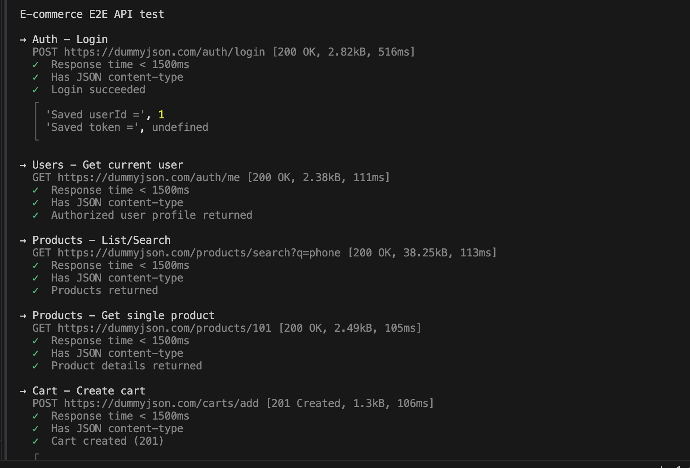
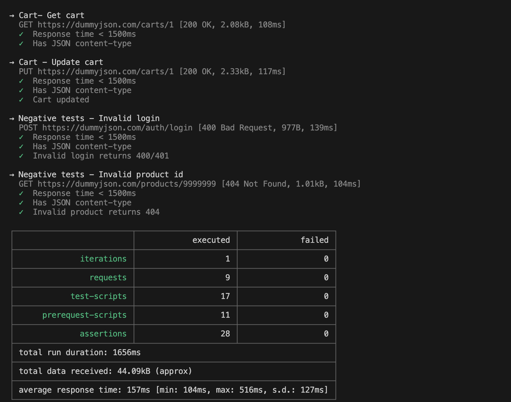
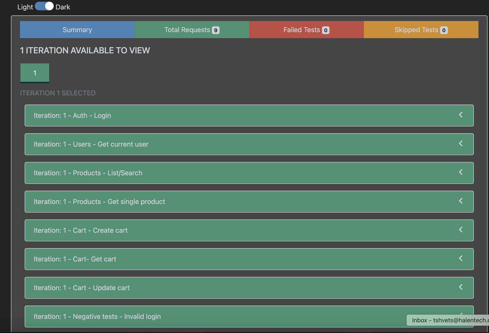
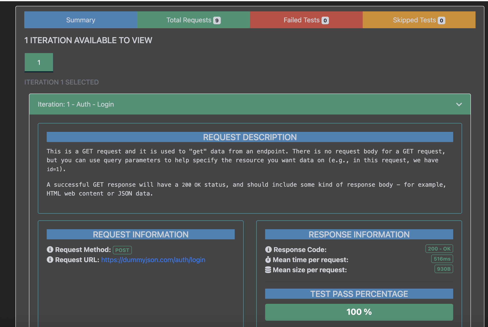

# E2E API Test Automation Framework (Postman + JS + CI)

## Overview
This repository contains an end-to-end (E2E) API test automation framework built with **Postman**, **Newman** (Postman's CLI runner), and **Node.js**, integrated with **GitHub Actions** for continuous integration.

## What it covers
- **Auth login + token handling** - Login flow with JWT/token validation and automatic token storage
- **Authenticated user validation** - Verifying user sessions and permission checks
- **Product search + contract checks** - Search functionality with API contract/schema validation
- **Cart create/get/update flow** - Full cart lifecycle testing (create, retrieve, modify)
- **Negative tests** - Error scenarios including bad auth, invalid IDs, and invalid requests
- **Performance budgets + CI reporting** - Response time assertions and HTML test reports

## Project Structure
```
postman/
├── collections/
│   └── ecommerce_e2e_api_tests.postman_collection.json    # Postman collection with all test cases
├── environments/
│   └── local.postman_environment.json                      # Environment variables for local testing
└── data/                                                  # Optional test data (CSV/JSON) for data-driven runs
reports/
└── report.html                                            # Generated HTML test report
.github/
└── workflows/
    └── newman.yml                                         # GitHub Actions CI workflow
package.json                                               # Node.js dependencies & Newman scripts
README.md                                                  # This file
```

## Prerequisites
- **Node.js** (v14 or higher recommended)
- **npm** (comes with Node.js)
- Git (for version control)

## Installation

Clone the repository and install dependencies:

```bash
git clone <repository-url>
cd <repository-directory>
npm install
```

## Run locally

To run the API tests locally (from the repository root):

```bash
npm install
npm run test:api
```

This command will:
1. Execute all test cases in `postman/collections/ecommerce_e2e_api_tests.postman_collection.json`
2. Use the environment file `postman/environments/local.postman_environment.json`
3. Generate CLI and HTML reports
4. Save the HTML report to `reports/report.html`

### View Test Report
After running the tests, open the generated HTML report:

```bash
open reports/report.html
```

### Example Report Screenshots
Sample report screenshots are available in the `example_reports/` folder. These images show the generated summary, request details, and report UI for a completed test run.









## Configuration

### Environment Variables
- Configure your test environment by editing `postman/environments/local.postman_environment.json`:
- Base API URL
- API credentials
- Authentication tokens
- Other environment-specific variables

## Continuous Integration

This project is configured with **GitHub Actions** for automated testing on every push and pull request.

### CI Workflow
The workflow file [.github/workflows/newman.yml](.github/workflows/newman.yml) performs:
- Checkout code
- Setup Node.js environment
- Install dependencies
- Run API tests
- Upload HTML report as artifact

Tests are automatically triggered on:
- Pushes to `main` or `master` branches
- Pull requests targeting those branches

## Test Categories

### Authentication Tests
- User login with credentials
- Token generation and validation
- Token refresh and expiration handling
- Invalid authentication rejection

### User Validation Tests
- Session verification
- User profile retrieval
- Permission checks

### Product Tests
- Product search and filtering
- Product details retrieval
- API contract validation

### Cart Operations
- Create new cart
- Add items to cart
- Retrieve cart contents
- Update quantities
- Remove items
- Cart summary

### Negative Tests
- Invalid authentication attempts
- Non-existent resource IDs
- Malformed requests
- Missing required fields
- Unauthorized access attempts

## Reporting

### HTML Reports
Detailed HTML reports are generated for each test run, including:
- Test execution summary
- Pass/fail statistics
- Response times and performance metrics
- Request/response details
- Error messages and assertions

Reports are stored in the `reports/` directory.

## Tools & Technologies
- **Postman** - API testing and collection management
- **Newman** - Postman CLI runner for automation
- **newman-reporter-htmlextra** - Enhanced HTML report generation
- **GitHub Actions** - CI/CD pipeline
- **Node.js/npm** - Runtime and package management

## Public API Source

This test automation framework is built against **[DummyJSON](https://dummyjson.com)**, a free public API that provides realistic mock data for:
- User authentication and account management
- Product catalog search and filtering
- Shopping cart operations
- Order management

DummyJSON is publicly available for testing and learning purposes and provides a comprehensive REST API for e-commerce scenarios. For more information, visit [https://dummyjson.com](https://dummyjson.com).

